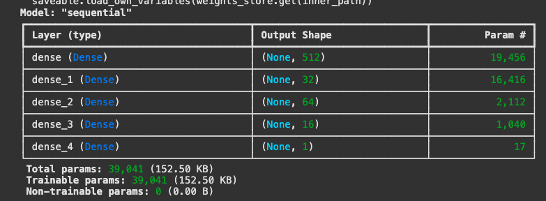

# deep-learning-challenge

## Background / Overview

  
**Per BCS Website:**

> The nonprofit foundation Alphabet Soup wants a tool that can help it select the applicants for funding with the best chance of success in their ventures. With your knowledge of machine learning and neural networks, you’ll use the features in the provided dataset to create a binary classifier that can predict whether applicants will be successful if funded by Alphabet Soup.
>
> From Alphabet Soup’s business team, you have received access to a CSV containing more than 34,000 organizations that have received funding from Alphabet Soup over the years. Within this dataset are a number of columns that capture metadata about each organization.

## Methodology

### Data Preprocessing
* `IS_SUCCESSFUL` is the target in the `charity_data.csv` dataset.
* The features in the model are:
	* `APPLICATION_TYPE`
	* `AFFILIATION`
	* `CLASSIFICATION`
	* `USE_CASE`
	* `ORGANIZATION`
	* `STATUS`
	* `INCOME_AMT`
	* `SPECIAL_CONSIDERATIONS`
	* `ASK_AMT`
* In the first model attempt (`AlphabetSoupCharity_Model.ipynb`), I removed `EIN` and `NAME` columns during preprocessing as these are neither features nor targets. In subsequent optimization attempts, I also removed `STATUS` and `SPECIAL_CONSIDERATIONS` columns, as 99% of the values belonged to one category in both columns.
* Utilize `pd.get_dummies() to encode categorical variables, then split preprocessed data into features X and y and use `train_test_split` to the split into training/testing datasets.
* Scale the training and testing features by creating a `StandardScaler` instance, fitting it to train the data, then using the `transform` function.
### Compiling, Training, Evaluating the Model
* In the initial model (`AlphabetSoupCharity_Model.ipynb`), I opted for three layers: the input layer, 1 hidden layer and the output layer. For the input and hidden layers, I defined 30 and 15 neurons, respectively, and assigned "relu" activation functions to both. The output layer had a sigmoid activation function. There was no specific rationale for these choices. It was just a test run.
	* **INITIAL RESULTS**: Did not reach target performance
* In `AlphabetSoupCharity_Model_Optimization_v1.ipynb`, I dropped the `STATUS` and `SPECIAL_CONSIDERATIONS` columns. I binned `APPLICATION_TYPE` values with total counts <1000 to "Other", and for `CLASSIFICATION`, values with total counts <200 to "Other".
	* In the first optimized model attempt, I added an additional layer (1 input, 2 hidden, 1 output).
	* Number of neurons in first three layers: 64, 32, 16. I head read that following the "power of 2" heuristic allows for more efficient computing since it aligns well with computational architecture.
	* I stuck with renu for the activation functions in the first three layers.
	* **OPTIMIZATION ATTEMPT 1 RESULTS**: Did not reach target performance
 * I increased the number of neurons in my second optimization attempt (same notebook). 128, 64, 8. All other parameters remained the same.
	* **OPTIMIZATION ATTEMPT 2 RESULTS**:  Did not reach target performance
* In `AlphabetSoupCharity_Model_Optimization_v2.ipynb`, I utilized `keras-tuner` in an attempt to optimize the parameters of my model to get the best possible accuracy. After a 32 minute analysis, `keras-tuner` suggested the following structure:

	* **OPTIMIZATION ATTEMPT 3 RESULTS**: Did not reach target performance

## Summary
Unfortunately, none of the 4 models reached the target accuracy rate of 75%.

| Attempt | Accuracy | Loss |
|  ----------------  |  :------:  |  ----:  |
| Initial | 72.8% | 55.1% |
| Optimization#1| 73.1% | 56.1% |
| Optimization#2| 72.9% | 57.1% |
| Optimization#3| 73.1% | 55.3% |

Perhaps using the sigmoid activation function would yield better results; however, sigmoid can lead to overfitting due to the "vanishing gradient" problem. Outside the realm of Neural Networks, Random Forest may be a viable option for an alternative model due to its ease of use and flexibility; it excels in classification and regression problems.

## Included in this Repository
* Models directory
	* `AlphabetSoupCharity.h5` - first attempt
	* `AlphabetSoupCharity_Optimization_v1.h5` - best model out of attempts 2 and 3
	* `AlphabetSoupCharity_Optimization_v2.h5` - model compiled by `keras-tuner`
* `AlphabetSoupCharity_Model.ipynb` - contains initial attempt
* `AlphabetSoupCharity_Model_Optimization_v1.ipynb` - first two optimization attempts
* `AlphabetSoupCharity_Model_Optimization_v2.ipynb` - final optimization attempt using `keras-tuner`
* Images directory
